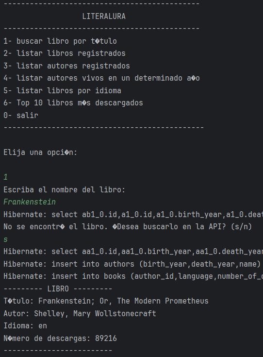
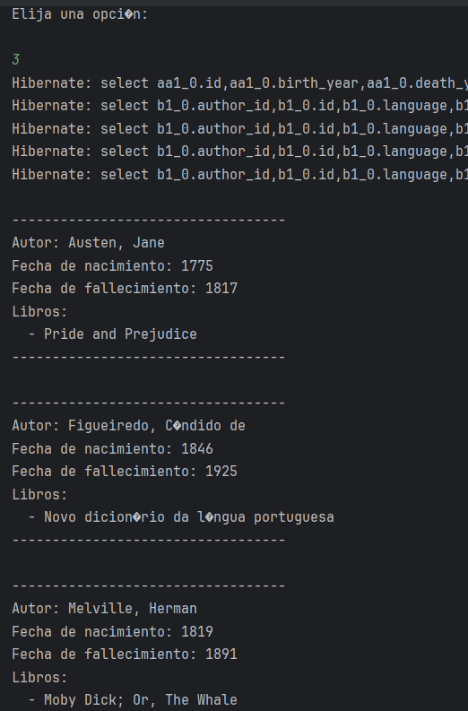
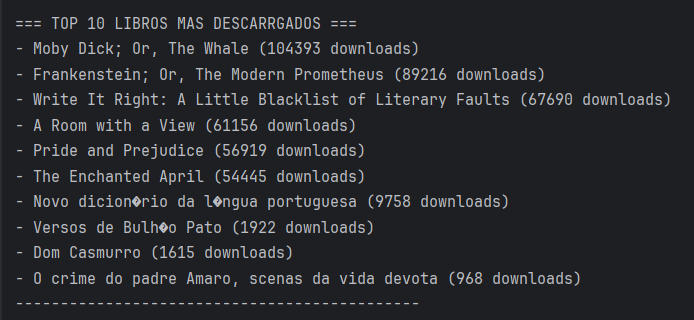

# 📚 Literalura - ONE Challenge

A Java/Spring Boot application for exploring literary works through the Gutendex API, developed for the **Oracle Next Education (ONE)** program.

## 🌟 Features
- Search books by title (via Gutendex API)
- Browse registered books and authors
- Filter authors alive in a specific year
- Filter books by language (English, Spanish, French, Portuguese)
- Show top 10 most downloaded books
- Persistent storage of book/author data
- Clean console-based interface

## 📸 Screenshots
- **option 1 - Search book**
  

- **option 3 - Show authors**
  

- **option 6 - Top 10 most downloaded books**
  
## 🛠️ Tech Stack

- **Java 21** - Core application language
- **Spring Boot** - Application framework
- **Spring Data JPA** - Database operations
- **Hibernate** - ORM implementation
- **PostgreSQL** - Relational database
- **Gutendex API** - Book data source
- **Lombok** - Code simplification
## 🚀 Installation

### Prerequisites
- Java 17+
- PostgreSQL 12+
- Maven 3.6+

### Setup
```bash
git clone https://github.com/yourusername/literalura-one.git
cd literalura-one
```
### Configuration
Create `application.properties` in `src/main/resources` with:
```bash
spring.datasource.url=jdbc:postgresql://localhost:5432/literalura
spring.datasource.username=youruser
spring.datasource.password=yourpassword
spring.jpa.hibernate.ddl-auto=update
```
### Running the Application
```bash
mvn spring-boot:run
```